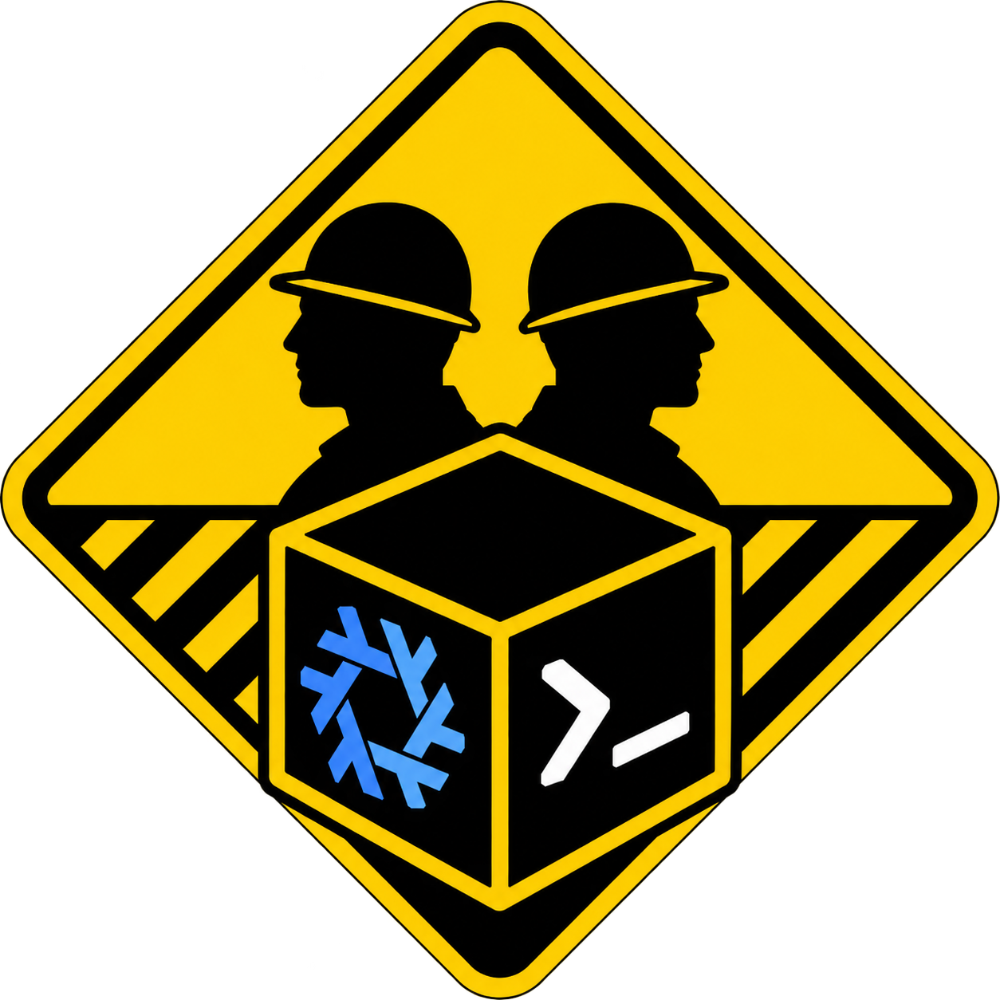

  

# mntwork

mntwork isolates autonomous agent activity around a named unit of work while
preserving the Git worktrees that participate in it.

The destination is a cross-platform CLI (`mntwork`) that provisions isolated Nix
and container worktree sandboxes across Podman, Docker, and Apple's `container`
CLI.

## Status

**Design stage — no implementation yet.** The command surface, Runtime Driver
contract, Nix artifact model, and Worktree Inspector are settled; the
implementation language and distribution mechanism are deliberately still open.

## Reading order

- [`CONTEXT.md`](CONTEXT.md) — the project's vocabulary. Terms like Workspace,
  Worktree Context, and Runtime Driver are load-bearing and defined there.
- [`docs/adr/`](docs/adr) — accepted decisions, recorded only where a trade-off
  is hard to reverse.
